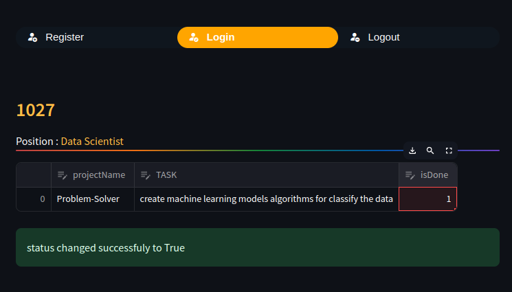

# streamlit-TaskManager
#### in this project :
```
 . you can create your account
 . you can creat team
 . you can apply for teams
 . you can generate the coverletter by ai using LLM
 . you can Add a task and My NLP classification will finde the best member can do the task in your team and just pass the task to that member automatically!
```

## Job Classification
#### First of all i decided to just remove extra **Columns** because for example we dont need something like **Benefits** And Also i remove extra jobs like **Teacher** , **Wedding Planner** & ...

##### Next Part : 
``` 
 . Removing Tags
 . Remove Special Characters
 . Convert Everything in Lower Case
 . Remove all Stopwords
 . Lemmatizing the Words
```
#### To Classify the Jobs by Text i decided to use LogisticRegression model **you can see the full code [here](./DashBoard/Model.py)**


<p align="center" width="100%">
  <br>
  <br>
  Adding Task.<br>
 
 <br>
 <br>
</p>

## Cover Letter Generator

##### LLaMa 2.0
- The heart of our Cover Letter Generator is the Llama 2 language model. It is Meta’s open source large language model.
- Replicate platform providing access to LLMs

## Streamlit

##### Parts :
``` 
 . Authentication
 . Permissions
 . Applying to Teams
 . Offers
 . Adding Tasks & Creating Projects
 . Status of The Tasks in each Projects
 . Changing status of the Tasks by Members
```

<p align="center" width="100%">
 <br>
 <br>
 
 
 
 <br>
 <br>
</p>

## Usage

##### cleaning dataset **[code](./DashBoard/classification/clean.py)** 
```zsh
cd DashBoard/classification/
python3 clean.py
```

##### creating database manually with **Python & Sqlite3 [code](./data/create_data.py)** 
```zsh
streamlit run main.py
```

##### main **[code](./main.py)**
```zsh
streamlit run main.py
```

## Technology Used
##### **Streamlit, Pandas, Numpy, scikit-learn, matplotlib, Llama 2, replicate, nltk, NLP, SQL**
